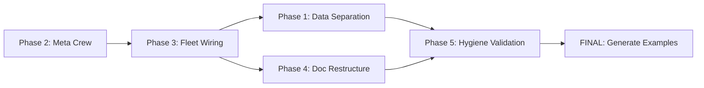
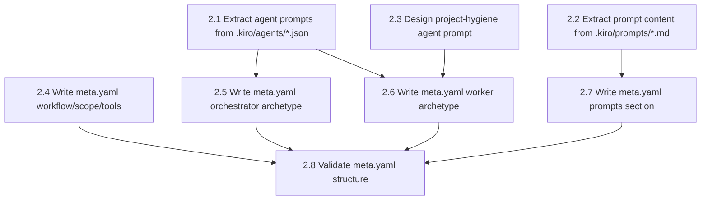
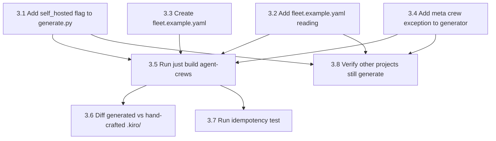
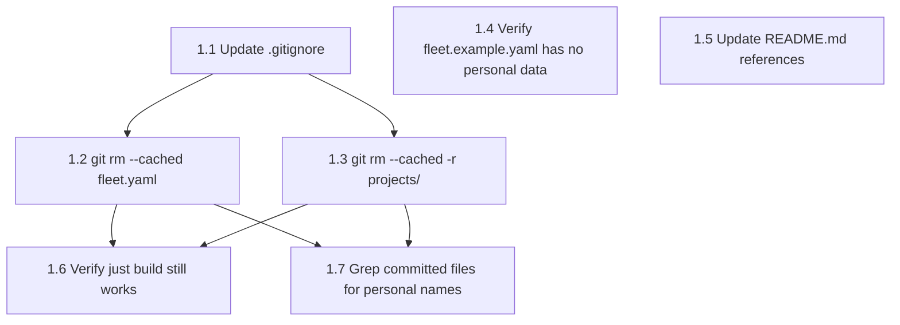
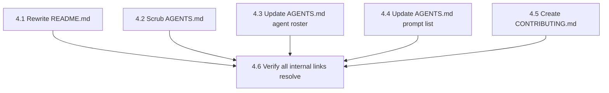
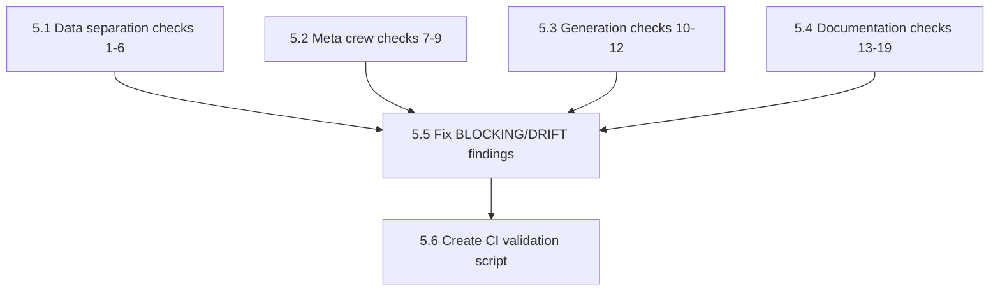
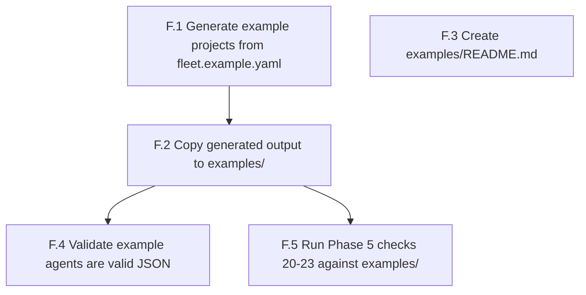

# Self-Hosted Plan — Task Graphs

## Master Plan DAG

Execution order: 2 → 3 → (1 ∥ 4) → 5 → FINAL

| Phase | Depends On | Notes |
|-------|-----------|-------|
| Phase 2 (Meta Crew) | — | Entry point, no deps |
| Phase 3 (Fleet Wiring) | Phase 2 | Needs meta.yaml |
| Phase 1 (Data Separation) | Phase 3 | ∥ with Phase 4 |
| Phase 4 (Doc Restructure) | Phase 3 | ∥ with Phase 1 |
| Phase 5 (Hygiene Validation) | Phase 1, Phase 4 | Join point |
| FINAL (Generate Examples) | Phase 5 | Terminal |

---

## Phase 2 — Meta Crew

---

## Phase 3 — Fleet Wiring

---

## Phase 1 — Data Separation

---

## Phase 4 — Doc Restructure

---

## Phase 5 — Hygiene Validation

---

## FINAL — Generate Examples

